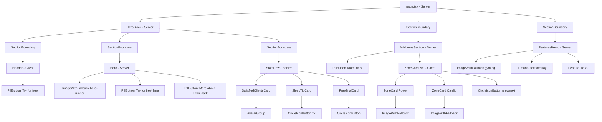

# Design Document

## Overview

This feature rebuilds the gym landing page from scratch as a composition of reusable React
components that faithfully reproduce the "TITAN" reference design. The page is assembled
top-to-bottom from five composed components inside a single root route:

1. **Header** — `.TITAN` logo, five nav links, "Log in", "Try for free" pill.
2. **Hero** — headline over the `hero-runner.jpg` background with two action buttons.
3. **Stats_Row** — three cards (white satisfied-clients, dark sleep-tip, lime free-trial).
4. **Welcome_Section** — "Sport center" tag, welcome heading, "More" button, and a
   carousel of zone image cards (Power zone, Cardio zone).
5. **Features_Bento** — dark bento grid of nine feature tiles over a gym background with a
   centered lime `.T` mark.

The Header, Hero, and Stats_Row are visually grouped inside a dark rounded **Hero_Block**.

The implementation targets the project's **modified Next.js 16.2.9** (App Router), React 19,
Tailwind CSS v4, TypeScript, and `lucide-react`. It uses only the Design_System tokens
(`primary`/`accent`/`neutral` families, the four typography roles, 4px-multiple spacing,
`max-w-8xl` centered layout) and the Satoshi font already wired in `layout.tsx`.

### Critical platform note (read before coding)

This is a **modified Next.js** with breaking changes from prior versions. Implementers MUST
read the relevant guides in `node_modules/next/dist/docs/` before writing any code:

- `node_modules/next/dist/docs/01-app/01-getting-started/12-images.md` — local image usage.
- `node_modules/next/dist/docs/01-app/03-api-reference/02-components/image.md` — `<Image>`
  props. **Breaking change confirmed in this version:** the `priority` prop is **deprecated**
  in favor of `preload`. The existing `Hero.tsx` uses `priority` and MUST be updated to
  `preload` during the rebuild. Also note `qualities` must be configured in `next.config.ts`
  if any image uses a non-default `quality` (we use the default `75`, so no config change is
  needed).
- `node_modules/next/dist/docs/01-app/01-getting-started/05-server-and-client-components.md`
  — server/client boundaries. Confirmed: `onLoad`/`onError` image callbacks and `useState`
  require `"use client"`.
- `node_modules/next/dist/docs/01-app/03-api-reference/directives/use-client` and
  `.../01-getting-started/04-linking-and-navigating.md` — navigation conventions.

> Research summary: In this Next.js version, `<Image>` requires either `width`/`height` or
> `fill`; `priority` is deprecated (use `preload`); image error/load handlers force a Client
> Component; local images live under `public/` and are referenced from `/`. Sources: the
> bundled docs listed above.

## Architecture

### Rendering model (server vs client)

By default App Router pages and components are **Server Components**. We keep as much as
possible on the server and push `"use client"` to the smallest interactive leaves.

| Component | Boundary | Reason |
|-----------|----------|--------|
| `page.tsx` | Server | Pure composition, no interactivity. |
| `HeroBlock` | Server | Presentational dark rounded wrapper. |
| `SectionBoundary` | Client | React error boundary (needs `componentDidCatch`/state) to isolate per-section render failures (Req 1.4). |
| `Header` | Client | Mobile nav toggle (`useState`) below 768px (Req 4.8). |
| `Hero` | Server | Static; delegates the image fallback to `ImageWithFallback`. |
| `ImageWithFallback` | Client | Uses `onError` to swap to a neutral fallback (Reqs 5.3, 8.5, 2.5). |
| `StatsRow` | Server | Static layout; the dark card's arrows are non-stateful controls. |
| `SatisfiedClientsCard` / `SleepTipCard` / `FreeTrialCard` | Server | Static content cards. |
| `WelcomeSection` | Server | Renders heading + the client `ZoneCarousel` as a child. |
| `ZoneCarousel` | Client | Carousel index state + prev/next handlers (Reqs 7.8–7.11). |
| `ZoneCard` | Server | Presentational image card. |
| `FeaturesBento` | Server | Static grid; background image via `ImageWithFallback`. |
| `FeatureTile` | Server | Presentational tile (text or stat variant). |
| `PillButton` / `CircleIconButton` / `AvatarGroup` | Server | Stateless; accept `onClick`/`href`. When rendered inside a client component they are included in that client bundle automatically. |

Client interactivity is isolated so the page streams as mostly static server-rendered HTML.
`Header` and `ZoneCarousel` are the only stateful islands; `ImageWithFallback` and
`SectionBoundary` are thin client wrappers.

### Component tree



### Composition and ordering (Req 1)

`page.tsx` renders the five components exactly once, in order, each wrapped in a
`SectionBoundary`. The boundary catches a render error from one component and renders
`null` for that component only, leaving the others intact (Req 1.4). No previous-page markup
remains; obsolete components (`PromoCard`, `MoreAboutButton`, `Button`, `FeatureCard`) are
removed or replaced by the new shared components (Reqs 1.1, 1.3, 3 — note the old
`PromoCard` violates the palette with `bg-[#c2f500]`/`text-white` and raw font sizes and is
deleted).

### Responsive strategy (Reqs 6, 9)

- Mobile-first Tailwind utilities; only integer spacing steps (4px multiples).
- **Stats_Row:** `grid grid-cols-1` (≤767px stacked white→dark→lime), tablet
  `md:grid-cols-2` or a non-overlapping arrangement (768–1023px, no clipping), and
  `lg:grid-cols-3` (≥1024px single row, equal alignment via `items-stretch`).
- **Header:** nav links `hidden lg:flex`; below `lg` a `Menu`/`X` toggle reveals all five
  links in a panel. Logo and "Try for free" stay visible and non-overlapping at ≤767px.
- **Global no-overflow:** root uses `overflow-x-hidden` safeguard; every section capped at
  `max-w-8xl mx-auto` with horizontal padding so content fits ≥320px without horizontal
  scroll.

## Components and Interfaces

### Shared primitives

```ts
// PillButton — the single shared pill button (Req 2.4).
type PillButtonVariant =
  | "primary"   // lime surface, *-foreground dark text, used for hero/header CTA
  | "dark"      // neutral-950 surface, neutral-50 text (Welcome "More")
  | "white"     // neutral-50 surface, neutral-950 text (Header "Try for free")
  | "ghost";    // translucent neutral glass on dark (Hero "More about Titan")

interface PillButtonProps {
  children: React.ReactNode;        // visible label
  variant?: PillButtonVariant;      // default "primary"
  href?: string;                    // renders <a> when present, else <button>
  onClick?: () => void;
  showArrow?: boolean;              // trailing circular ArrowUpRight chip
  ariaLabel?: string;               // required when label is not descriptive enough
  disabled?: boolean;
}
```

```ts
// CircleIconButton — circular icon control reused for card arrows and carousel controls.
import type { LucideIcon } from "lucide-react";

type CircleButtonVariant = "light" | "dark" | "lime" | "outline";

interface CircleIconButtonProps {
  icon: LucideIcon;                 // e.g. ArrowUpRight, ArrowLeft, ArrowRight
  ariaLabel: string;                // required — icon-only control
  variant?: CircleButtonVariant;    // default "dark"
  size?: "sm" | "md" | "lg";        // maps to 4px-multiple h/w (40/48/56px)
  href?: string;
  onClick?: () => void;
  disabled?: boolean;               // sets aria-disabled + visible disabled style
}
```

Both primitives expose a visible focus ring (`focus-visible:ring-4 focus-visible:ring-ring/50`)
and accessible labels (Reqs 5.4, 5.5).

### ImageWithFallback (Client)

Wraps `next/image`. Tracks an internal `errored` state; on `onError` it renders a neutral
fallback surface instead of a broken image, while the surrounding layout/text remain visible.

```ts
import type { ImageProps } from "next/image";

interface ImageWithFallbackProps
  extends Omit<ImageProps, "onError"> {
  /** Tailwind classes for the fallback surface, e.g. "bg-neutral-800". */
  fallbackClassName?: string;
}
```

Behavior:
- Renders `<Image {...props} onError={() => setErrored(true)} />` while OK.
- On error, renders a `div` with `fallbackClassName` (default `bg-neutral-800`) covering the
  same reserved box (parent keeps `width/height` or `fill` dimensions), so no layout shift
  and no broken-image icon. Satisfies Reqs 5.3 (hero), 8.5 (bento bg), and the image branch
  of 2.5 (Zone_Card/Feature_Tile missing image → placeholder).

### SectionBoundary (Client)

A minimal React error boundary. Renders `children` normally; if a child throws during
render, it logs and renders `null` so only the failed section is omitted (Req 1.4).

```ts
interface SectionBoundaryProps {
  name: string;                     // for logging which section failed
  children: React.ReactNode;
}
```

### Header (Client)

```ts
interface HeaderProps {
  navLinks?: { label: string; href: string }[]; // defaults to the five required labels
}
```

- Renders `.TITAN` with a lime dot (`text-primary` on the leading dot).
- Five links "Services", "Schedule", "Gallery", "Plans", "Contacts" linking to in-page
  section anchors (`#services`, …) so activation scrolls within 1s using CSS
  `scroll-behavior: smooth` (Reqs 4.2, 4.6).
- "Log in" link and a `PillButton variant="white"` "Try for free" (Reqs 4.3, 4.4, 4.7).
- `useState` mobile menu: `Menu`/`X` toggle below `lg`, panel reveals all five links
  (Reqs 4.8, 9.4).

### Hero (Server)

- Headline rendered with `text-heading` in `text-neutral-50`, exact text
  **"Be helthier. Be stronger. Be confident."** as specified in Req 5.1 (note the reference
  spelling "helthier" is intentional per the requirement).
- `ImageWithFallback` background: `fill`, `object-cover` (cover without distortion, Req 5.2),
  `sizes` set, `preload` (LCP, replacing deprecated `priority`), `alt=""` (decorative
  background behind the headline, Req 10.2), `fallbackClassName` left transparent so the dark
  Hero_Block shows through (Req 5.3).
- `PillButton variant="primary"` "Try for free" with arrow (Req 5.4) and
  `PillButton variant="ghost"` "More about Titan" (Req 5.5).

### Stats_Row and cards (Server)

`StatsRow` renders three cards in a responsive grid (Reqs 6.1, 6.6, 9):

- `SatisfiedClientsCard` — white (`bg-neutral-50`), exact text "10,000+ satisfied clients",
  `AvatarGroup` (1–5 avatars), supporting text (Req 6.2).
- `SleepTipCard` — dark (`bg-neutral-800`), two `CircleIconButton` (`ChevronLeft`/`ChevronRight`),
  exact sleep text, footer "Moscow, Russia" / "Nov.20" (Req 6.3).
- `FreeTrialCard` — lime (`bg-primary`), exact "Get 14 days for free" + "Just give us a call
  or message us in the chat", a `CircleIconButton`. All text uses `*-foreground` dark tokens,
  never white on lime (Reqs 6.4, 6.5, 3.6).

```ts
interface AvatarGroupProps {
  avatars: { src?: string; alt: string }[]; // 1..5; missing src → neutral circle placeholder
  max?: number;                              // default 5
}
interface FreeTrialCardProps { title?: string; subtitle?: string; href?: string; }
interface SleepTipCardProps  { quote?: string; location?: string; date?: string; }
```

### Welcome_Section and ZoneCarousel

`WelcomeSection` (Server) renders the "Sport center" pill tag, the welcome heading
(`text-heading`, `text-foreground`, Req 7.2), a `PillButton variant="dark"` "More"
(Req 7.3), and the client `ZoneCarousel`.

```ts
interface ZoneCardProps {
  imageSrc: string;        // "/images/power-zone.jpg" | "/images/cardio-zone.jpg"
  imageAlt: string;        // informative alt (Req 10.2)
  tag: string;             // 1..40 chars (Req 2.2) — "Power zone" / "Cardio zone"
  caption: string;         // 1..200 chars (Req 2.2)
  href?: string;
}

interface ZoneCarouselProps {
  cards: ZoneCardProps[];  // [Power zone, Cardio zone]
}
```

`ZoneCarousel` (Client) holds `currentIndex` and renders the active `ZoneCard`(s) plus one
left and one right `CircleIconButton` anchored bottom-right of the section (Req 7.8). Next
advances, Prev goes back, each within 500ms via CSS transition (Reqs 7.9, 7.10). At a
boundary the index is unchanged and the actioned control is shown disabled (Req 7.11). Each
`ZoneCard` renders exactly one in-bounds circular arrow control (Req 7.7).

### Features_Bento and FeatureTile (Server)

`FeaturesBento` renders a `bg-neutral-950` rounded panel containing an `ImageWithFallback`
gym background (`fill`, `object-cover`, `alt=""` decorative; `fallbackClassName="bg-neutral-800"`
solid neutral on failure, Req 8.5), the centered lime `.T` text mark layered above the
background and behind the tiles (Req 8.4), and a grid of nine `FeatureTile`s split into a
left group of 4 and right group of 5 (Reqs 8.1–8.3).

```ts
import type { LucideIcon } from "lucide-react";

type FeatureTileVariant = "text" | "stat";

interface FeatureTileProps {
  variant?: FeatureTileVariant;     // default "text"
  text: string;                     // 1..200 chars (Req 2.3); for "stat" this is the label
  statValue?: string;               // e.g. "4", "500 M²" — required when variant="stat"
  icon?: LucideIcon;                // lucide icon for text tiles
  imageSrc?: string;                // optional image source alternative to icon
  imageAlt?: string;
}
```

The `.T` mark is rendered as decorative text (`aria-hidden`), not an image or icon, so it is
exempt from the `next/image`/`lucide-react` rules. Its large display size is a decorative
logomark; to honor the "no raw font sizes" rule it uses a design-system role
(`text-heading`) scaled via a transform utility rather than an arbitrary `text-[8rem]`.

### Icon mapping (lucide-react, Req 10.4)

| Usage | lucide-react icon |
|-------|-------------------|
| Pill/card trailing arrow | `ArrowUpRight` |
| Carousel / sleep-card prev / next | `ArrowLeft` / `ArrowRight` (Welcome), `ChevronLeft` / `ChevronRight` (Stats) |
| Mobile nav open / close | `Menu` / `X` |
| Professional coaches tile | `Asterisk` |
| Medical office tile | `Plus` (or `Stethoscope`) |
| Wi-Fi tile | `Wifi` |
| Fitness trackers tile | `Watch` |
| Bar / drinks tile | `CupSoda` (or `GlassWater`) |
| Massage tile | `Hand` (or `Sparkles`) |
| Tanning bed tile | `Sun` |

No raw inline SVG, icon fonts, or image-as-icon are used.

## Data Models

The page is presentational; "data" is static content passed as props. Types are colocated
with components; shared content constants live in the relevant component module.

```ts
// Static content model for the page
interface NavLink { label: string; href: string; }

const NAV_LINKS: NavLink[] = [
  { label: "Services",  href: "#services"  },
  { label: "Schedule",  href: "#schedule"  },
  { label: "Gallery",   href: "#gallery"   },
  { label: "Plans",     href: "#plans"     },
  { label: "Contacts",  href: "#contacts"  },
];

const ZONE_CARDS: ZoneCardProps[] = [
  { imageSrc: "/images/power-zone.jpg",  imageAlt: "Free-weights power zone",
    tag: "Power zone",  caption: "Space for working with free weights" },
  { imageSrc: "/images/cardio-zone.jpg", imageAlt: "Cardio training zone",
    tag: "Cardio zone", caption: "Space for working with free weights" },
];

// Carousel state model (pure, drives ZoneCarousel)
interface CarouselState {
  currentIndex: number;   // 0 .. count-1
  count: number;          // number of zone cards (>= 1)
}
type CarouselAction = "next" | "prev";

// Derived flags
// leftDisabled  = currentIndex === 0
// rightDisabled = currentIndex === count - 1
```

The carousel transition function is the one piece of non-trivial, input-varying logic and is
extracted as a **pure reducer** so it can be unit- and property-tested independently of the
DOM:

```ts
function carouselReducer(state: CarouselState, action: CarouselAction): CarouselState {
  if (action === "next") {
    return { ...state, currentIndex: Math.min(state.currentIndex + 1, state.count - 1) };
  }
  return { ...state, currentIndex: Math.max(state.currentIndex - 1, 0) };
}
```

Prop-validation/placeholder helpers (for Req 2.5) are also pure:

```ts
// Returns true when a required string prop is missing/blank → render a visible placeholder.
function isBlank(value: string | undefined | null): boolean {
  return value == null || value.trim().length === 0;
}
```

## Correctness Properties

*A property is a characteristic or behavior that should hold true across all valid executions
of a system — essentially, a formal statement about what the system should do. Properties
serve as the bridge between human-readable specifications and machine-verifiable correctness
guarantees.*

This feature is predominantly UI rendering, static design-system compliance, responsive
layout, navigation, and build tooling — areas that are **not** suited to property-based
testing (they are covered by example, snapshot, static-scan/lint, and integration tests in
the Testing Strategy below). Property-based testing applies only to the narrow slice of
**pure, input-varying logic**: the carousel transition reducer, the bounded-length content
rendering of the two reusable card/tile components, and the blank-required-prop resilience
helper. The following properties cover that slice.

### Property 1: Carousel navigation stays in bounds and steps by one

*For any* card count `n ≥ 1`, *any* starting index `i` in `[0, n-1]`, and *any* finite
sequence of `"next"`/`"prev"` actions applied through `carouselReducer`, the resulting index
always remains within `[0, n-1]`; a `"next"` increments the index by exactly 1 unless the
index is already `n-1` (in which case it is unchanged and the right control is disabled), and
a `"prev"` decrements by exactly 1 unless the index is already `0` (in which case it is
unchanged and the left control is disabled).

**Validates: Requirements 7.9, 7.10, 7.11**

### Property 2: Zone_Card renders any valid tag, caption, and image

*For any* image source, tag string of length 1–40, and caption string of length 1–200, a
single `ZoneCard` definition renders successfully and the rendered output contains the
provided tag text, the provided caption text, and an image referencing the given source.

**Validates: Requirements 2.2**

### Property 3: Feature_Tile renders any valid text and visual

*For any* text content of length 1–200 together with either an icon source or an image
source, a single `FeatureTile` definition renders successfully and the rendered output
contains the provided text and the chosen visual (icon or image).

**Validates: Requirements 2.3**

### Property 4: Missing required props degrade gracefully with a placeholder

*For any* required string prop value that is blank (empty or whitespace-only), the affected
component (`ZoneCard` or `FeatureTile`) still renders without throwing, displays a visible
placeholder in place of the missing prop, and continues to render all other provided content.

**Validates: Requirements 2.5**

## Error Handling

| Scenario | Requirement | Handling |
|----------|-------------|----------|
| A composed section throws during render | 1.4 | `SectionBoundary` (error boundary) catches it, logs `name`, and renders `null` for that section only; the other four sections render normally. |
| Hero background image fails to load | 5.3 | `ImageWithFallback` `onError` swaps to a transparent/neutral fallback box of the same reserved size; the dark Hero_Block background shows through and the headline/buttons stay legible. |
| Features_Bento gym background fails to load | 8.5 | `ImageWithFallback` renders a solid `bg-neutral-800` surface in the reserved box; the nine tiles and the `.T` mark continue to render. |
| Avatar image missing/fails | 6.2 | `AvatarGroup` renders a neutral circle placeholder for that slot; the group still shows 1–5 avatars. |
| Required `ZoneCard`/`FeatureTile` prop blank | 2.5 | `isBlank` detects empty/whitespace; the component renders a visible placeholder for the missing prop and still renders the remaining provided content, never crashing. |
| Invalid/out-of-range carousel action at a boundary | 7.11 | `carouselReducer` clamps via `Math.min`/`Math.max`; index is unchanged and the actioned control renders disabled (`aria-disabled` + visible disabled style). |
| Image optimization misconfig (e.g. non-default `quality`) | 10.1, 10.3 | Use default quality and local `public/` sources so no `qualities`/`remotePatterns` config is needed; every image sets `fill` or `width`+`height` to reserve layout. |
| TypeScript type error at build | 10.5, 10.6 | The build (`next build`) fails with a non-zero exit and reports file/location; CI treats this as a hard failure. |

## Testing Strategy

### Tooling

- **Test runner:** none is configured in the project yet. Set up **Vitest** + **React
  Testing Library** (`@testing-library/react`, `jsdom` environment) for component and unit
  tests — the standard choice for a React/TypeScript/Vite-compatible stack. Run with the
  `--run` flag for single (non-watch) execution.
- **Property-based testing:** use **`fast-check`** (the standard PBT library for
  TypeScript/JS). Do **not** hand-roll generators or iteration loops.
- **Static design-system compliance:** a small Node/Vitest script scans `src/` component
  source for disallowed tokens (foreign hues, raw hex, `bg-[...]` colors, raw font-size
  utilities, fractional/arbitrary spacing, white-on-lime) — covering the SMOKE-classified
  criteria 3.1, 3.2, 3.3, 3.6, 6.5, 10.1, 10.3, 10.4. Reuse ESLint where possible.
- **Build verification:** `npm run build` (and `tsc --noEmit`) must complete with zero type
  errors (criteria 10.5, 10.6).

### Dual approach

- **Unit / component (example) tests** cover the concrete, fixed-content criteria: exact
  text, structure, ordering, classes, focus rings/aria labels, layout class assertions, the
  error-boundary isolation case, and the image-failure fallback cases (forcing `onError`).
- **Property tests** cover the four universal properties above.
- **Integration / e2e** (Playwright recommended) covers navigation/scroll timing (4.6, 4.7),
  the ≥320px no-horizontal-scroll integrity (9.5), and end-to-end build behavior (10.6).

### Property test configuration (when PBT applies)

- Each property is implemented as a **single** `fast-check` property test.
- Minimum **100 iterations** per property (`fc.assert(fc.property(...), { numRuns: 100 })`).
- Each property test is tagged with a comment referencing the design property, in the format:
  **Feature: titan-landing-page, Property {number}: {property_text}**
- Generators:
  - P1: `fc.integer({ min: 1, max: 12 })` for count, `fc.nat` mapped into range for start
    index, and `fc.array(fc.constantFrom("next","prev"))` for the action sequence.
  - P2: `fc.string({ minLength: 1, maxLength: 40 })` for tag,
    `fc.string({ minLength: 1, maxLength: 200 })` for caption, plus an image source.
  - P3: `fc.string({ minLength: 1, maxLength: 200 })` for text and a generated icon/image
    source.
  - P4: a blank-string generator (empty plus whitespace variants:
    `fc.stringOf(fc.constantFrom(" ", "\t", "\n"))` unioned with `fc.constant("")`).

### Mapping criteria to tests

- **PROPERTY:** 7.9 / 7.10 / 7.11 → Property 1; 2.2 → Property 2; 2.3 → Property 3;
  2.5 → Property 4.
- **EXAMPLE / snapshot:** 1.1–1.4, 2.1, 2.4, 3.4, 3.5, 4.1–4.5, 4.8, 5.1–5.5, 6.1–6.4, 6.6,
  7.1–7.8, 8.1–8.5, 9.1–9.4, 10.2.
- **SMOKE (static scan / build):** 3.1, 3.2, 3.3, 3.6, 3.7, 6.5, 10.1, 10.3, 10.4, 10.5.
- **INTEGRATION (e2e):** 4.6, 4.7, 9.5, 10.6.
